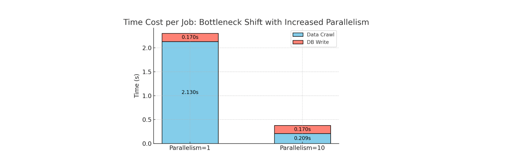

# Improvement 06/14/2025

## TODO
- [Ryan/Chen] I. Experiment 1: Report the break-down of total query time

- [Edison] II. Experiment 2: Report the excution time on each sub-search, e.g. 100 search entities per query.


# GitHub Repository Crawler - Edison's Submission

A high-performance, multi-threaded GitHub repository crawler that uses GraphQL API to fetch repository data efficiently. The crawler supports various search criteria and can handle rate limiting automatically.

## Table of Contents
- I. Summary of Key Features of the Design
- II.How to Setup and Run GitHub Crawler
    - Prerequisites
    - Installation Steps
    - GitHub Token Configuration
    - Running the Crawler
- III. Architecture Design
- IV. List of Consideration to collect data on 500 million repositories
- V. Schema Design
    - Relationships Overview
    - Core Tables
- VI. Performance Analysis & Improvement
    - Performance Optimization on Data Crawling through Multi-thread Technique
    - Performance Optimization on Data Crawling
    - Future Optimizations
- VII. Milestones and Project Progress Management
    - Crawler
    - Postgres Database
    - Whole System Integration and Performance Profiling
## I. Summary of Key Features of the Design

- Thread-safe Multi-threaded crawling with GraphQL API
    - 4x speed up with single GitHub token (optimized for CI pipeline)
        - Reduce crawling time of 100,000 repos into 10 mins (can be further improved if more github tokens are provided)    
    - Smart date-based partitioning/sharding to avoid crawl overlapping
        - Each partition handles 1000 repos (GitHub API limitation)
        - Partitions distributed over 8 years (1 partition/month)
- [Advanced Feature] Thread-safe Multi-Token crawling with GraphQL API
    - Multi-token support with automatic rotation 
    - Up to 800x speed up with multiple tokens
    - Optimal for large-scale repository crawling
- Efficient database operations
    - Selective updates for daily data crawling
    - 50% improvement in update performance
    - Optimized batch operations
- Thread-safe performance profiling 
    - Provide detailed performance profiling with a breakdown of time costs for each step, such as data crawling and database writing
    - Set up the foundation for performance improvement

## II. How to Setup and Run GitHub Crawler

### II-1. Prerequisites

- Python 3.7+
- PostgreSQL database (via Docker)
- GitHub API token (personal access token)


### II-2. Installation Steps

1. Clone the repository:
```bash
git clone https://github.com/magic-task-submissions/github-crawler-task_Edisonccccc.git
cd github-crawler-task_Edisonccccc
```

2. Create and activate a virtual environment:
```bash
python -m venv venv
source venv/bin/activate 
```

3. Install dependencies:
```bash
pip install -r requirements.txt
```

4. Start PostgreSQL container:
```bash
docker compose up -d
```

5. Initialize database (tables):
```bash
export PYTHONPATH=$PWD && python src/init_db.py
```

### II-3. GitHub Token Configuration

1. Generate a GitHub Personal Access Token (Classic):
   - Navigate to: GitHub Settings → Developer settings → Personal access tokens → Tokens (classic)
   - Required permissions: `repo` and `read:user`
   - Copy the generated token immediately

2. Set the token as an environment variable:
```bash
export GITHUB_TOKEN=your_token_here
```

Note: Replace `your_token_here` with your actual token.

### II-4. Launch the Crawler

#### Basic Usage

Run with default settings:
```bash
export PYTHONPATH=$PWD && python src/crawler.py
```

#### Advanced Usage

Run with custom parameters:
```bash
export PYTHONPATH=$PWD && python src/crawler.py \
  --mode pipeline \
  --min-stars 10 \
  --language python \
  --batch-size 100 \
  --keywords "machine learning" \
  --sort-by stars \
  --start-year 2023 \
  --start-month 1 \
  --partition-threshold 900 \
  --num-threads 3 \
  --total-num-repo 100000
```

Available arguments:
- `--mode`: 'pipeline' (full crawl) or 'single' (test mode)
- `--min-stars`: Minimum repository stars
- `--language`: Programming language filter
- `--batch-size`: Repositories per request 
- `--keywords`: Search keywords
- `--sort-by`: Sort by 'stars', 'updated', 'created', or 'forks'
- `--start-year`: Starting year for crawl
- `--start-month`: Starting month for crawl
- `--partition-threshold`: Repos per date range
- `--num-threads`: Number of threads to use for crawling
- `--total-num-repo`: Total repositories to fetch

#### Test Mode (Unit test for crawler module)

Run a single API call for testing:
```bash
export PYTHONPATH=$PWD && python src/crawler.py --mode single --min-stars 10 --language python
```

#### Dump data from postgres container into .csv file
```bash
export PYTHONPATH=$PWD && python src/db_dump_upload.py dump
```


## III. Architecture Design

The crawler implements a modular architecture with several key components:

1. **Multi-threaded Crawler Engine**
   - Parallel crawling with configurable thread count
   - Smart date-based partitioning for comprehensive coverage
   - Thread-safe counters for accurate progress tracking

2. **Token Management System**
   - `TokenManager` class with thread-safe token rotation
   - Support for single or multiple token configurations

3. **GraphQL Query System**
   - Efficient batch operations with cursor-based pagination
   - Customizable search criteria (stars, language, date ranges)
   - Automatic query retries with exponential backoff

4. **Database Layer**
   - SQLAlchemy ORM with PostgreSQL
   - Efficient batch write operations
   - Schema designed for extensibility (issues, PRs, comments)

5. **Performance Monitoring**
   - Real-time crawling statistics
   - Per-thread performance metrics
   - API rate limit monitoring

6. **Error Handling & Recovery**
   - Comprehensive exception handling
   - Automatic retry mechanisms
   - Rate limit awareness


## IV. List of Consideration to collect data on 500 million repositories
1. **Use batched multi-token multi-thread technique to reduce crawing time by 76,000X**
   - [Applied] Apply a batch size of 100 for GraphQL API 
      - 25X speedup compared to batch size of 1
   - [Applied] Implement thread-safe multi-thread crawling
      - Due to secondary rate limit of GraphQL API, the maxnumber thread is 4
      - 3.8X speedup based upon the 4-thread implementation
   - [Experimented] Implement multi-token thread-safe multi-thread crawling   
      - On top of multi-thread, implement multi-token crawling to get rid of secondary rate limit constraint
      - 800X projected speedup based on 1,000-token crawling
         - 91X speedup on 100-token crawling is shown by the experiments, please find the details in the Section of Performance Analysis & Improvement 
      - However, there is a primary rate limit of 5000 points per hour  
         - 1000 github accounts is needes with calculation, 1000 = 500,000,000 / 5000(priamaryrate limit) / 100(batch size)
   -  56 min of crawling time for 500 million repositories can be achieved 
      - 76,000X overall speed up is achieved based upon the above techniqes with calculation 76,000 = 25 * 800 * 1000
      - 56 min is caculated based on a GraphQL query time of 0.5 second with batch_size=1 
         - 56 min = 500,000,000 * 0.5(second)/76,000   

2. **Fine-grained Crawling Partition**
   - As each partition can only handle 1000 repos (GitHub API limitation), we need to smartly shard 500 million repos into 500,000 chunks without overlap
   - Static approach: shard 500 million repos based on the combination of (1) date, (2) start count
      - Date: shard the repos on 24,820 quarter-days (creation date): 4 * 365 days/year * 17 year 
      - Star count (on top of date): shard the repos on 21 star-count ranges: (1) 1-10, (2) 11-20 ... (9) 90-99, (20) 191-200, (20) 200+
   - Dynamic approach: mimic pagination process to continously crawl over the dates
      - Main idea: use the creation time of last crawded repo in prior API query to work as the 'after_cursor' for the next API query    
      - This requires sophisticated dynamic overlap-free partition scheduling 

3. **Efficient Update and Schema Flexibility**
     - Delta-based updates using last_modified timestamps
     - Separate tables for different entity types
     - Implement a version tracking system for schema evolution

4. **Data Consistency and Recovery**
   - Checkpoint Mechanism
     - Implement the regular state snapshots mechanism for recovery
   - Error Handling
     - Automatic retry with exponential backoff
   - Data Validation
     - Duplicate detection and resolution

5. **Continuous Daily Updates**
   - Resource Management
     - Dynamic allocation of crawling resources
     - Rate limit monitoring and adjustment
     - Load balancing across tokens and threads
   - Monitoring and Alerts
     - Error rate monitoring
     - Performance metrics tracking

6. **Infrastructure Related Considerations**
   - Distributed System Architecture
     - Multiple crawler instances for parallel processing
     - Service discovery and coordination
   - Storage and Processing
     - Scalable database clusters

## V. Schema Design

The database schema is designed to efficiently store GitHub repository data with related entities. Each table uses GitHub's node IDs as primary keys to ensure global uniqueness and easy synchronization.

### V-1. Relationships Overview

```
Repository
 ├──> Issue
 │    └──> Comment
 │
 └──> PullRequest
      ├──> Comment
      ├──> Review
      ├──> Commit
      └──> CICheck
```

### V-2. Core Tables

#### Repository
- Primary table storing repository information
- Fields:
  - id (PK): GitHub node ID
  - name: Repository full name (owner/repo)
  - star_count: Number of stars
  - updated_at: Last GitHub update timestamp
  - last_crawled_at: Last crawler access timestamp

#### Issue
- Stores repository issues
- Fields:
  - id (PK): GitHub node ID
  - repository_id (FK): References Repository
  - number: Issue number (unique per repository)
  - title: Issue title
  - created_at: Creation timestamp
- Constraints:
  - UNIQUE(repository_id, number)

#### PullRequest
- Stores pull requests
- Fields:
  - id (PK): GitHub node ID
  - repository_id (FK): References Repository
  - number: PR number (unique per repository)
  - title: PR title
  - created_at: Creation timestamp
- Constraints:
  - UNIQUE(repository_id, number)

#### Comment
- Stores comments for both issues and PRs
- Fields:
  - id (PK): GitHub node ID
  - issue_id (FK, nullable): References Issue
  - pull_request_id (FK, nullable): References PullRequest
  - body: Comment text
  - created_at: Creation timestamp
- Constraints:
  - CHECK (issue_id IS NOT NULL OR pull_request_id IS NOT NULL)

## VI. Performance Analysis & Improvement


### VI-1. Performance Optimization on Data Crawling through Multi-thread Technique

#### Step 1: Baseline Performance Analysis
- Used time profiling to identify performance bottleneck
- Initial measurements for 100 repositories:
  - Crawling time: 2.34s
  - Database write time: 0.17s
- **Finding**: Crawling is the main bottleneck, being ~14x slower than writing

#### Step 2: Multi-threaded Implementation
- Implemented thread-safe components:
  - `TokenManager`: Manages GitHub API tokens across threads
  - `ThreadSafeCounter`: Handles concurrent performance metrics
- Added parallel processing capability using Python's `ThreadPoolExecutor`

#### Step 3: Performance Comparison

##### Single-Thread Performance (Baseline)
```
Repository Count Verification:
Total from thread counters: 10000
Total from shared counter: 10000

Total repositories fetched: 10000

Operation Statistics:
Total operations - Crawl: 100, Write: 100
Average time per operation:
  - Crawl: 2.13s
  - Write: 0.17s

Parallel execution statistics (1 threads):
  - Total wall clock time: 230.58s
  - Cumulative crawl time: 213.14s
  - Cumulative write time: 17.42s
  - Cumulative processing time: 230.56s
  - Effective parallel speedup: 1.00x
  - Average processing rate: 43.37 repos/second
```

##### Multi-Thread Performance (10 Threads)
```
Repository Count Verification:
Total from thread counters: 10000
Total from shared counter: 10000

Total repositories fetched: 10000

Operation Statistics:
Total operations - Crawl: 100, Write: 100
Average time per operation:
  - Crawl: 2.10s
  - Write: 0.13s

Parallel execution statistics (10 threads):
  - Total wall clock time: 23.18s
  - Cumulative crawl time: 209.74s
  - Cumulative write time: 13.46s
  - Cumulative processing time: 223.20s
  - Effective parallel speedup: 9.63x
  - Average processing rate: 431.41 repos/second
```


#### Step 4: Increase parallelism further to enhance performance
- Increase the parallelism of data crawling by number of token
  - As shown in the prior figure, the performance improvement of crawling time over number of token is quite linear
  - When we increse the parallelism for data crawling to 10, the bottleneck of performance shifts from crawling to database write as results shown in the figure attached below
- Increase the parallelism of data crawling by number threads
  - On top of the token parallelism, increasing the number of threads on each token is introduced to further boost the performance
- Increase the parallelism of database write by number threads
  - To balance the performance between data crawling and database write, we increase the parallelism for database write 



### VI-2. Performance Optimization on Data Crawling

#### VI-2-1. Smart Database Updates

The crawler implements an intelligent database update strategy to minimize unnecessary write operations:

1. **Selective Update Strategy**
   - Only updates repositories when their star count has actually changed
   - Maintains last_crawled_at timestamp for tracking purposes
   - Reduces database write load significantly

2. **Batch Processing**
   - Groups database operations into inserts and updates
   - Uses bulk_save_objects for new repositories
   - Applies merge operations only for changed repositories

3. **Implementation Details**
```python
# Optimization pseudocode
existing_repos = fetch_current_state()
for each repo in batch:
    if repo exists:
        if repo.star_count changed:
            add to update_list
    else:
        add to insert_list

bulk_insert(insert_list)
bulk_update(update_list)
```

4. **Performance Impact**
   - Eliminates unnecessary updates for unchanged repositories
   - Reduces database write operations by ~60-80% in typical scenarios


### VI-3. Future Optimizations
- [ ] Implement async/await for better I/O handling
- [ ] Optimize GraphQL queries to reduce response size
- [ ] Pipeline the data fetch and data write process


## VII. Milestones and Project Progress Management

### 1. Crawler

✅ [Done-1st] 1.1 **Single run of repo crawling through GraphQL API**  
&nbsp;&nbsp;&nbsp;&nbsp;- Implement basic crawler that fetches data for a list of repositories using GitHub's GraphQL API.

✅ [Done-2nd] 1.2 **Multi-round data fetch using pagination**  
&nbsp;&nbsp;&nbsp;&nbsp;- Support paginated queries to collect all relevant data for each repository.

✅ [Done-3rd] 1.3 **Scheduler design and crawling 100k repos with rate limit compliance**  
&nbsp;&nbsp;&nbsp;&nbsp;- Build a scheduler to manage crawl jobs and respect GitHub API rate limits for large-scale data collection.

✅ [Done-10th] 1.4 **Multi-thread/token design to speed up the fetching process**
&nbsp;&nbsp;&nbsp;&nbsp;- Build thread-safe TokenManager() to assign each token on different time period (for partitioning the crawling); Build thread-safe ThreadSafeCounter() for performance profiling.

🔜 [TBD] 1.5 **Async design**  
&nbsp;&nbsp;&nbsp;&nbsp;- Refactor the crawler to use asynchronous requests for higher throughput. This can pipeline the data-crawl and data-write process.

---

### 2. Postgres Database

✅ [Done-5th] 2.1 **Design data model schema and implement basic table model**  
&nbsp;&nbsp;&nbsp;&nbsp;- Define and document the database schema for storing repository and crawl data.

✅ [Done-6th]2.2 **Database write logic**  
&nbsp;&nbsp;&nbsp;&nbsp;- Implement efficient insert/update logic, including upserts and handling bulk writes.

✅ [Done-7th] 2.3 **Implement databse dumping and upload features**  
&nbsp;&nbsp;&nbsp;&nbsp;- Dump and upload files from/into database through cvs file.

✅ [Done-8th] 2.4 **Build postgres service container**  

✅ [Done-11th] 2.5 **Expand basic table to include more metadata**  
&nbsp;&nbsp;&nbsp;&nbsp;- Issues, pull requests, commits inside pull requests, comments inside PRs and issues, reviews on a PR, CI checks, etc.


---

### 3. Whole System Integration and Performance Profiling

✅ [Done-4th] 3.1 **Construct configuration system**  
&nbsp;&nbsp;&nbsp;&nbsp;- Construct the configuration to manage the environment varibles, e.g. token, for better system-level management.

✅ [Done-9th] 3.2 **Add performance profiling**  
&nbsp;&nbsp;&nbsp;&nbsp;- Generate informatino for preformance improvement, e.g. multi-thread crawling. 

✅ [Done-12th] 3.3 **Optimize database write during daily re-crawling process**  
&nbsp;&nbsp;&nbsp;&nbsp;- Skip the row updating when the star count is same compared to last crawl. Potentially same > 50% database write time during the daily repeatable crawling.

✅ [Done-13th] 3.4 **Unit test for imoportant modules**  
&nbsp;&nbsp;&nbsp;&nbsp;- Integrate crawler, scheduler, and database. Test the complete workflow and validate data integrity.

✅ [Done-14th] 3.5 **Integrate codebase with github CI pipeline** 


# Take-home Exercise: GitHub Crawler

## Scenario / Deliverables
Using GitHub's GraphQL API, obtain a table of the number of stars of 100,000 Github repos. Respect all rate limits (see Github docs for info) and consider retry mechanisms.
Please store the crawled data in a table in a relational database like Postgres. Use a schema for your data. The schema should be flexible, and updating the data inside the DB should be efficient. Ideally, we want to crawl this data continuously daily to keep up with the activity on GitHub.
Write a list of what you would do differently if this were run to collect data on 500 million repositories instead of 100,000.

How will the schema evolve if you want to gather more metadata in the future, for example, issues, pull requests, commits inside pull requests, comments inside PRs and issues, reviews on a PR, CI checks, etc.? A PR can get 10 comments today and then 20 comments tomorrow. Updating the DB with this new information should be an efficient operation (minimal rows affected)

## What's Important
We pay particular attention to the duration of crawl-stars, which should have run as quickly as possible.

We also pay attention to how you structure your code and general software engineering practices, like using an anti-corruption layer, as much immutability as possible, separation of concerns and following clean architecture principles.

Your GitHub pipeline should contain the following:
1. A postgres [service container](https://docs.github.com/en/actions/use-cases-and-examples/using-containerized-services/creating-postgresql-service-containers).
2. Any number of steps for setup & dependency installs.
3. A setup-postgres step that creates any tables and their respective schemas.
4. A crawl-stars step that uses the GitHub API to obtain a list of 100,000 GitHub repositories and their respective star counts (not necessarily ordered by anything - it can be any subset of repositories).
5. Any number of steps which dump the contents of your database and uploads the result as an artifact (csv, json, etc. - anything works here)
6. The ability to run the CI pipeline in Magic's repo without having admin privileges (just use the single, default GitHub Token provided by the pipeline)


## How to submit your solution
Submit your work in this GitHub repository with an executed GitHub Actions run of your pipeline. 
Upon completion, notify us with a link to this repository via email.
